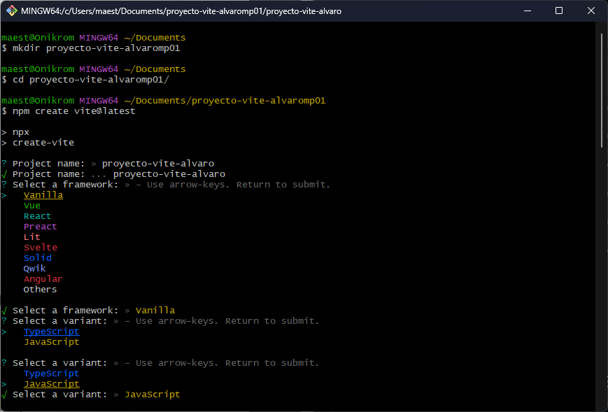
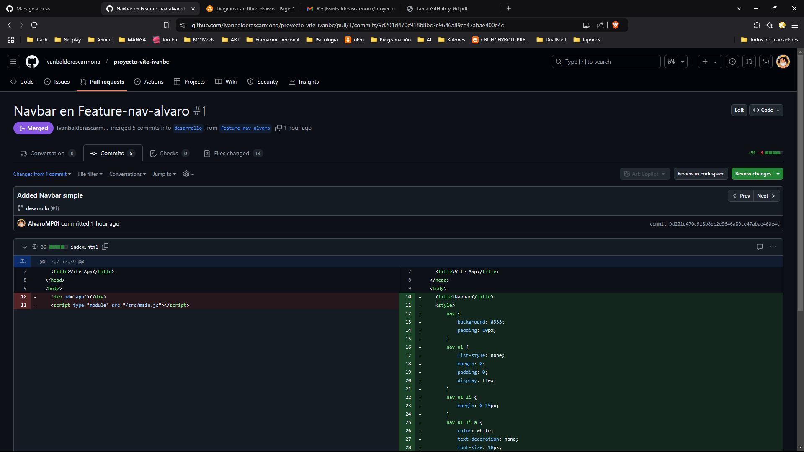
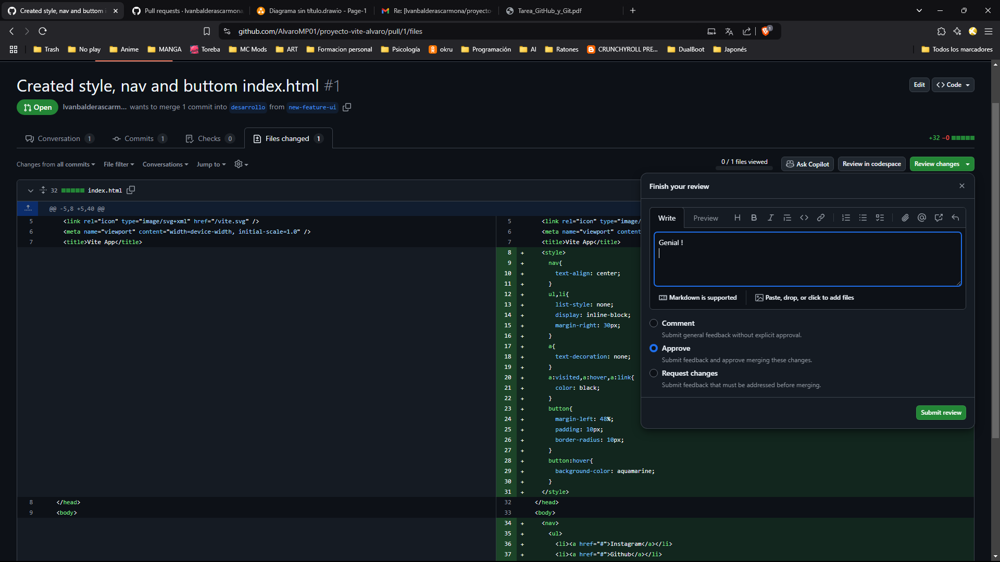

# Proyecto Vite - Alvaro

## Parte 1: Configuración Inicial

### 1. Creamos un repositorio en GitHub de nombre _*proyecto-vite-alvaro*_


### 2. Creamos el directorio local del proyecto y lo inicializamos con Vite

```bash
npm create vite@latest 
cd proyecto-vite-alvaro 
npm install 
```



### 3. Inicializar un proyecto con Vite en el directorio local y realizar el primer commit

```bash
git init
git add .
git commit -m "Inicialiced"
```


### 4. Conectar el repositorio local con GitHub


## Parte 2: Trabajo con Ramas

### 1. Crear dos ramas nuevas

```bash
git checkout -b desarrollo
git checkout -b feature-ui
```


### 2. En la rama feature-ui

Se han hecho modificaciones en la parte de Index.html

- He modificado el título de la página
- He añadido un enlace a mi perfil de GitHub

Una vez hechos estos cambios, he realizado un commit sobre la rama feature-ui y un push a GitHub


### 3. En la rama desarrollo

Se han hecho modificaciones en la parte de Index.html

- He modificado el título y los datos de la página
- He añadido  un enlace de interes sobre JavaScript
- He añadido un enlace a mi perfil de GitHub

Una vez hechos estos cambios, he realizado un commit sobre la rama desarrollo y un push a GitHub


## Parte 3: Colaboración

### 1. Añadimos los colaboradores del proyecto

En GitHub he añadido los colaboradores del proyecto


### 2. Trabajamos en el proyecto del compañero

Una vez que nos hayan añadido como colaboradores, vamos a trabajar en el proyecto del compañero y para ello clonamos el repositorio.

```bash
gut checkout main
git clone https://github.com/nombre-compañero/proyecto-vite-nombre.git
cd proyecto-vite-nombreCompañero
```

Ya conectados al repositorio del compañero, vamos a crear y trabajar en la rama feature-nav-alvaro

```bash
git checkout -b feature-nav-alvaro
```


Una vez estemos situados en la rama feature-nav-alvaro, vamos a hacer una modificaciones en el index.html

- He añadido una barra de navegación simple con enlaces a paginas de interés como  puede ser la página de Markdown, información sobre JavaScript y mi perfil de GitHub.



Una vez hechos estos cambios, he realizado un commit sobre la rama feature-nav-alvaro y un push a GitHub


Ya hecho el commit & push, vamos a hacer un pull request a la rama desarrollo del repositorio del compañero


### 3. Gestionamos el pull request

Nuestro compañero ha solicitado una revisión del pull request que él ha realizado sobre la rama desarrollo. En GitHub, vamos a hacer una revisión del pull request y aceptamos los cambios que se hayan hecho despues de revisarlos (Approve).



Cuando hayamos aprobado el pull request, vamos a hacer un merge sobre la rama desarrollo del repositorio.

## Parte 4: Documentación

### 1. Creamos un archivo README.md

```bash
touch README.md
```


## Documentación adicional

### Árbol de commits


